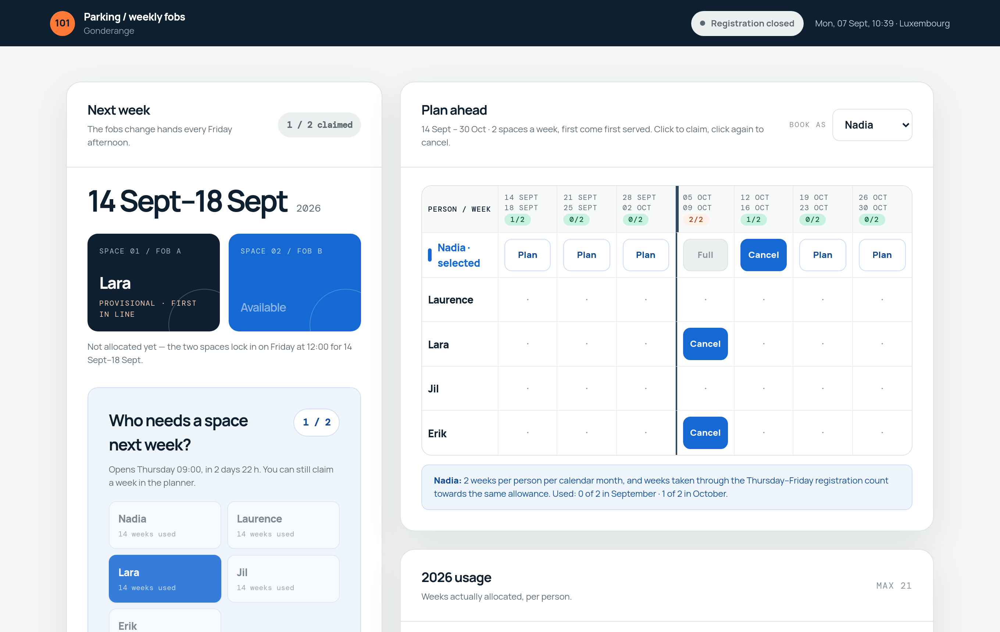

# 101 Parking

**Two spaces. Five colleagues. One week each, first come first served.**

A small booking app for a shared garage in Gonderange. It decides who gets the two parking
fobs each week, keeps everyone inside their quota, and settles the allocation on its own
every Friday at noon so nobody has to run it.

The whole application is one PHP file plus a MySQL database.



<sub>Screenshot shows demo data, not real bookings.</sub>

---

## The rules it enforces

The point of the app is that these are checked on the server, not left to good manners.

| | |
| --- | --- |
| Spaces in the garage | **2** |
| Weeks per person per month | **2** |
| Weeks per person per year | **21** |
| Planning horizon | **Next week → end of next month** |
| Registration window | **Thursday 09:00 → Friday 12:00** (Europe/Luxembourg) |
| Allocation | Friday 12:00, to whoever booked the week first |

Two ways to claim a week, sharing one quota:

- **The planner** — claim any week from next week to the end of next month, at any time.
- **The weekly registration** — grab whatever is still free for next week, during the
  Thursday–Friday window.

A week taken through either route counts the same, so the two cannot be combined to get a
third week. A Monday–Friday week belongs to the month holding its **Wednesday**, so a week
straddling two months counts against exactly one of them — and because the horizon spans two
calendar months, each carries its own two-week allowance.

The planner starts at *next* week rather than next month for a reason: it used to open on
next month only, which left a dead zone. On Monday the 7th nobody could claim the week of the
14th, because the planner refused it and the Thursday registration window had not opened yet.

At Friday noon the two spaces go to the two people who booked the week earliest. Anyone
already at 21 weeks for the year is skipped and the space passes down the queue.

---

## Try it

### In your browser, no setup — GitHub Codespaces

**Code → Codespaces → Create codespace on main.** The container starts PHP and MySQL
together and imports the schema on first boot. Open the **Ports** tab, set port 8080 to
**Public**, and the forwarded address is a link you can share.

It stops after 30 minutes idle, it spends your free Codespaces hours, and deleting the
codespace deletes the bookings. Good for showing people; use Render for the real thing.

### On your machine

Docker only — no PHP or MySQL needed locally:

```bash
docker compose -f .devcontainer/docker-compose.yml up --build
```

Then open <http://localhost:8080>. Prefix `APP_PORT=8896` if something already holds 8080,
and `down -v` throws the database away for a clean start.

### Hosted

[](https://render.com/deploy?repo=https://github.com/vibecoder3000/parking-101)

Render's free tier has no MySQL, so the database comes from a provider that does — Aiven,
TiDB Cloud and Clever Cloud all have a free tier — and Render runs only the app. Full steps
in [Deploying](#deploying).

---

## How it works

`parking.php` is the entire application: it renders the page and answers the JSON endpoints
the page posts back to. There is no build step and no framework.

**The server owns every date.** Which week is next and which month is open are decided in
Europe/Luxembourg and sent to the browser. The page used to recompute them from the browser
clock, which disagreed across time zones and around midnight.

**Capacity is guarded by a lock, not a key.** Two spaces per week is a limit across *two*
tables — monthly plans and weekly registrations — so no unique index can express it. Both
booking routes take a MySQL named lock on the week, and the automatic allocation takes a
second, separate one so two simultaneous page loads cannot both fill slot 1.

**The queue is the booking order.** `monthly_plans.created_at` and
`weekly_registrations.registered_at` merge into one ordered list per week. Editing a
registration only inserts and deletes the names that actually changed, so an existing
booking keeps its original timestamp and its place in line.

**It settles itself.** Any page load past a week's Friday 12:00 cutoff completes that week's
allocation, including the running week — so a Friday where nobody opened the page still
gets sorted out on the next visit. The page re-reads state every 60 seconds and whenever the
tab regains focus.

### Data model

| Table | Holds |
| --- | --- |
| `members` | The five eligible names |
| `monthly_plans` | Weeks claimed in advance |
| `weekly_registrations` | Late sign-ups during the Thursday–Friday window |
| `weekly_allocations` | The settled result: two slots per week |
| `fob_log` | Handover / return / lost / damaged records |

---

## Configuration

Credentials come from the environment, or from `config.php` if you prefer a file. Anything in
the environment wins, so nothing secret needs to be committed — `config.php` is gitignored.

| Variable | Notes |
| --- | --- |
| `MYSQL_HOST`, `MYSQL_PORT` | Hosted MySQL rarely uses 3306 — check |
| `MYSQL_DATABASE`, `MYSQL_USER`, `MYSQL_PASSWORD` | |
| `MYSQL_SSL_CA` | A file path, `system` for the machine's CA bundle, or the certificate text itself |
| `MYSQL_SSL_VERIFY` | `false` skips hostname verification. Last resort |
| `PARKING_ACCESS_CODE` | See below |

For a local install without Docker: import `schema.sql`, copy `config.example.php` to
`config.php`, fill it in, and upload both files to any host with `PDO_MySQL`.

### Access code

The app has **no per-person login** by design — anyone who opens it can book or cancel as any
of the five names. That is fine on an office network and not fine on a public URL. Set
`PARKING_ACCESS_CODE` and the page asks for a shared code once per browser session before
anything is reachable, JSON endpoints included. Leave it unset and the page is wide open.

---

## Deploying

1. Create a free MySQL and note the host, port, database, user and password.
2. Import `schema.sql` into it.
3. Render → **New → Web Service**, connect this repo, **Docker** runtime, **Free** plan.
   (`render.yaml` describes the same service if you deploy as a Blueprint.)
4. Set the `MYSQL_*` variables above, plus `MYSQL_SSL_CA` — hosted MySQL requires TLS.
   `system` works for providers using a public CA; Aiven signs with its own, so paste the
   contents of its `ca.pem` into the variable instead.
5. Set `PARKING_ACCESS_CODE` before you share the URL.

The free plan sleeps after inactivity, so the first request after a quiet spell takes a few
seconds. It has no persistent disk, which does not matter — all state is in the database.

---

## Reference

<details>
<summary><b>The holiday calendar</b></summary>

Computed in the browser, covering **2026 to 2035**. Eight of Luxembourg's eleven legal public
holidays are fixed dates; Easter Monday, Ascension (+39) and Whit Monday (+50) derive from
Easter Sunday. Every year in the range was checked against PHP's `easter_date()`.

A holiday falling on a weekend is listed but flags no week — it cannot land inside a
Monday–Friday parking week. Luxembourg grants a compensatory day for a Sunday holiday, but
that is between employee and employer, not a parking rule.

To go past 2035, change `PARKING_END_YEAR` and the matching `END_YEAR` in the browser code.
Nothing else is year-bound.
</details>

<details>
<summary><b>Known gaps and deliberate choices</b></summary>

- **No login**, as above. `PARKING_ACCESS_CODE` gates the page as a whole, not individual
  names. The `fob_update` endpoint is unauthenticated the same way and accepts any Monday
  and any slot.
- **The fob log is dead weight.** `fob_log`, the `fob_update` endpoint and the `lostFobFee`
  value are wired up server-side, but nothing in the page reads or writes them. The €100 fee
  shown on the page is fixed text.
- **The `members` table is decorative.** Eligibility comes from the `PARKING_MEMBERS`
  constant in PHP, and `members.active` is never consulted. Adding a colleague means editing
  the constant *and* inserting the row, or the foreign key rejects their bookings.
- **Nothing ties an allocation to a booking.** `weekly_allocations` has no constraint
  requiring a matching plan or registration; only application logic prevents a stray row.
- **`GET_LOCK` needs MySQL 5.7+** for the nested case to behave.
- **MySQL's session time zone is pinned to PHP's** on connect. Without it, `CURRENT_TIMESTAMP`
  and PHP's `date()` disagreed by the UTC offset and wrote two times into the same row.
</details>

<details>
<summary><b>Repository layout</b></summary>

| Path | |
| --- | --- |
| `parking.php` | The entire application — page, endpoints, styles, browser code |
| `schema.sql` | Tables, keys and the `Jill` → `Jil` migration |
| `config.example.php` | Copy to `config.php` for a file-based install |
| `Dockerfile` | PHP 8.3 + Apache image used by Render and Codespaces |
| `render.yaml` | Render Blueprint |
| `.devcontainer/` | Codespaces and the local Docker stack |
</details>
